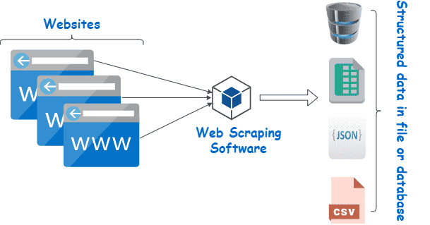

# 🚀 Web Scraper Java



## Descripción del Proyecto

Este proyecto es una aplicación Java simple diseñada para extraer datos de una página web estática (`index.html`) y sentar las bases de la **Recopilación de Datos** para sistemas de IA. Utiliza la biblioteca `Jsoup` para analizar el contenido HTML, extraer información específica de productos (título y precio), limpiar los datos y guardarlos en un archivo CSV estructurado.

El proyecto está contenedorizado usando Docker, lo que permite un entorno de desarrollo y ejecución consistente.

## Funcionalidad de `Scraper.java`

El archivo principal `Scraper.java` realiza las siguientes acciones:

1. **Carga del HTML:** Lee y analiza un archivo local llamado `index.html`.
2. **Selección de Elementos:** Busca en el documento todos los elementos que tienen la clase CSS `producto`.
3. **Extracción de Datos:** Para cada producto encontrado, extrae el **título** y el **precio**.
4. **Limpieza de Datos:** Procesa el texto del precio para hacerlo apto para formatos numéricos (elimina símbolos y reemplaza comas por puntos).
5. **Generación de CSV:** Construye una cadena de texto en formato CSV con las cabeceras `Titulo;Precio_Euros`.
6. **Guardado de Archivo:** Escribe los datos estructurados en un nuevo archivo llamado `productos_limpios.csv` en el directorio raíz del proyecto.

## Cómo Ejecutar el Proyecto (Entorno de Desarrollo)

Para ejecutar la aplicación, es necesario tener Docker instalado. El proceso se realiza en dos pasos principales:

### 1. Construir y Levantar el Contenedor

Este comando construye la imagen de Docker y mantiene el entorno Java/Maven en ejecución en segundo plano (`-d`) para que puedas trabajar e iterar.

```bash
docker-compose up --build -d

```

### 2. Ejecutar y Probar el Código

Una vez que el contenedor (`java-scraper-dev`) esté en funcionamiento, usa estos comandos para entrar y ejecutar tu aplicación.

1. **Entrar al Contenedor:**
```bash
docker exec -it java-scraper-dev bash

```


2. **Ejecutar el Script de Scraper:**
*Este script compila (`mvn compile`) y ejecuta (`mvn exec:java`) tu código Java en un solo paso rápido.*
```bash
./run.sh

```


## Resultado

Después de ejecutar el script, se creará un archivo llamado `productos_limpios.csv` en el directorio del proyecto (gracias al mapeo de volumen de Docker). Este archivo contendrá los datos **estructurados** extraídos del `index.html` **no estructurado**.

---

# 🎯 TAREA: El Scraper del Mundo Real

El objetivo principal del *scraping* en la **Recopilación de Datos** (Sección 4.3) es obtener la información que la IA necesita. En la práctica, las páginas web reales son más complejas que nuestro `index.html`.

## Fase A: Entendiendo la Complejidad Real

Ahora que el `Scraper.java` funciona, tu reto es adaptarlo para extraer datos de una página real de internet.

**⚠️ Advertencia Importante:**

Las páginas web modernas pueden ser complicadas de "scrapear" por varias razones:

1. **Bloqueo:** El sitio web puede detectar que eres un bot (por el User-Agent de Java) y bloquear la conexión.
2. **JavaScript:** Gran parte del contenido (como los precios) puede cargarse dinámicamente con JavaScript, y Jsoup (por defecto) solo lee el HTML inicial.
3. **Selectores Variables:** Las clases CSS (`.titulo-producto`, `.precio`) pueden cambiar con frecuencia.

## Fase B: Adaptando `Scraper.java` para Internet

Modifica tu archivo `Scraper.java` para que, en lugar de leer el `index.html` local, se conecte a una URL externa.

* **Pista de Jsoup:** Para conectarte a una URL, debes reemplazar la línea:
```java
File input = new File("index.html");
Document doc = Jsoup.parse(input, "UTF-8", "");

```

...por un comando de conexión y *fetch*:
```java
Document doc = Jsoup.connect("URL_DE_LA_PÁGINA").get();

```


## 🌐 Propuesta de Página Web Sencilla

Para evitar el bloqueo y el JavaScript dinámico, te sugiero buscar **blogs, páginas de documentación, o sitios web muy simples** y con estructuras HTML limpias.

**Ejemplo de Sitios Fáciles de Estructura Simple (si están disponibles y no tienen bloqueo):**

1. **Páginas de Clasificación de Películas/Libros:** Busca una lista de libros clásicos o películas en un sitio que **no** sea Amazon o Netflix. Por ejemplo, una lista de películas en una página de reseñas simples, o una lista de ligas deportivas que publiquen tablas de resultados simples (solo texto, sin gráficos complejos).
* **Ejemplo de Dato a Extraer:** Título de la película (`h3`) y Puntuación (`span` con clase `score`).


2. **Páginas de Noticias/Blogs Antiguos:** Busca la página de archivo de un blog simple.
* **Ejemplo de Dato a Extraer:** Título de la entrada y Fecha de publicación.


**Tarea:**

1. Elige una URL externa con datos tabulares o de lista.
2. Inspecciona el código HTML de esa página (usando F12 en tu navegador) para encontrar los selectores CSS correctos (p.ej., la `class` o el `id` del título y del precio/puntuación).
3. Modifica `Scraper.java` para conectarse a esa URL y usar los nuevos selectores.
4. Ejecuta `./run.sh` y verifica que el nuevo archivo CSV se genere con los datos reales extraídos de Internet.
